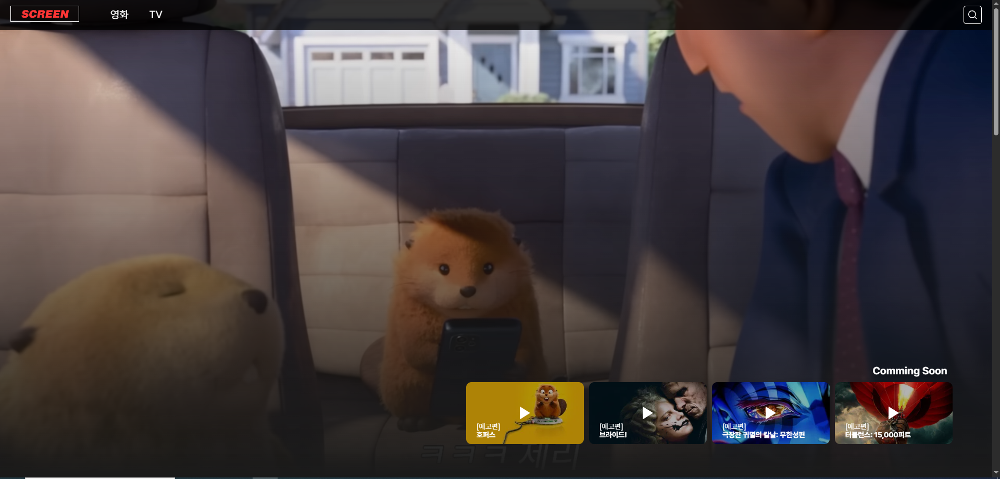
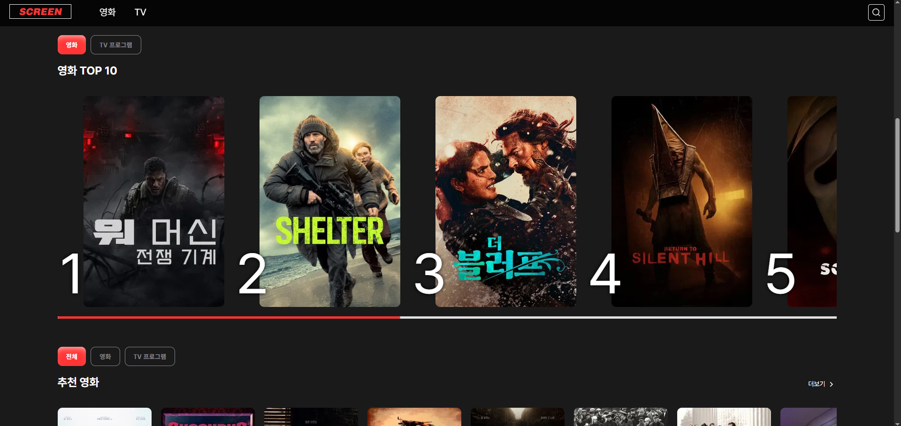
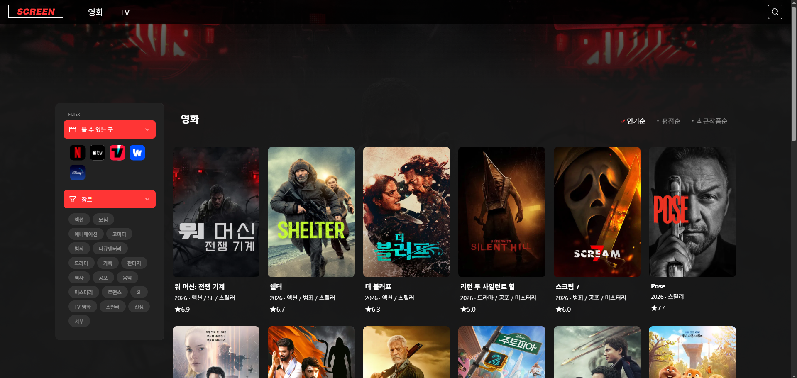
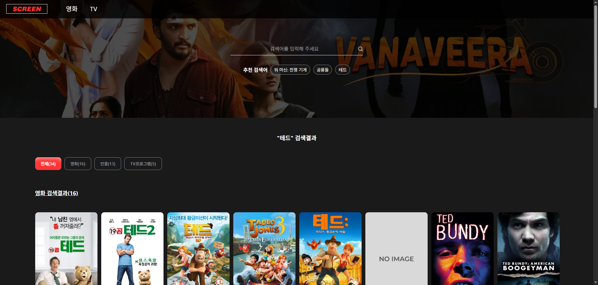
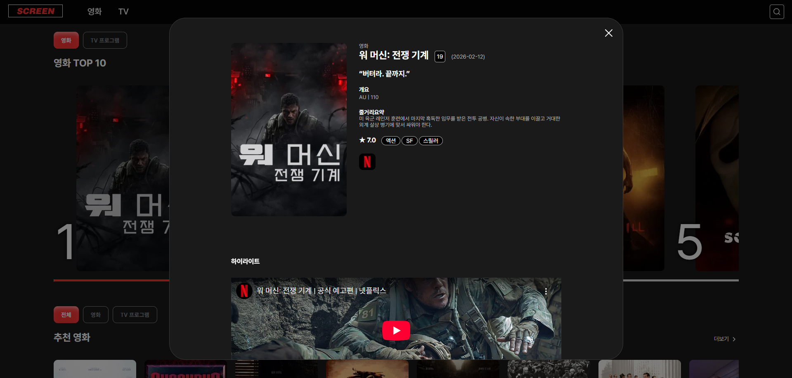
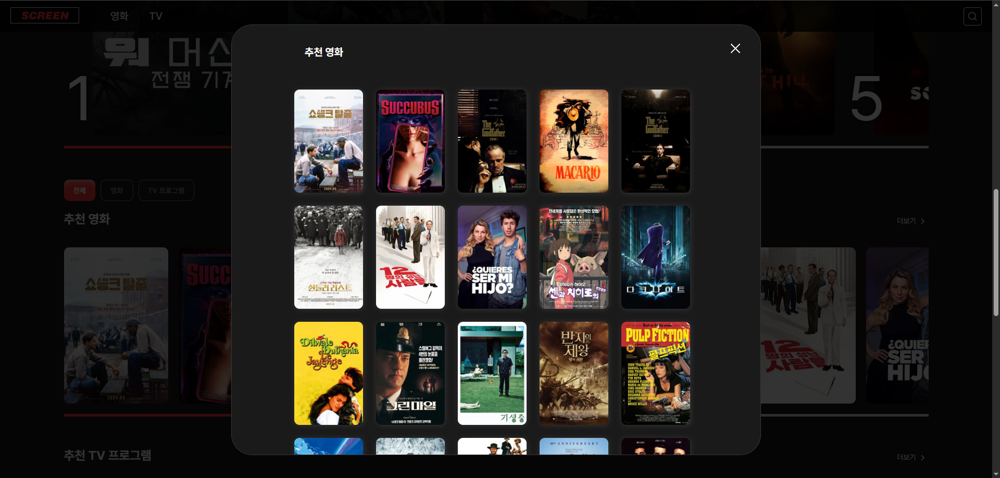
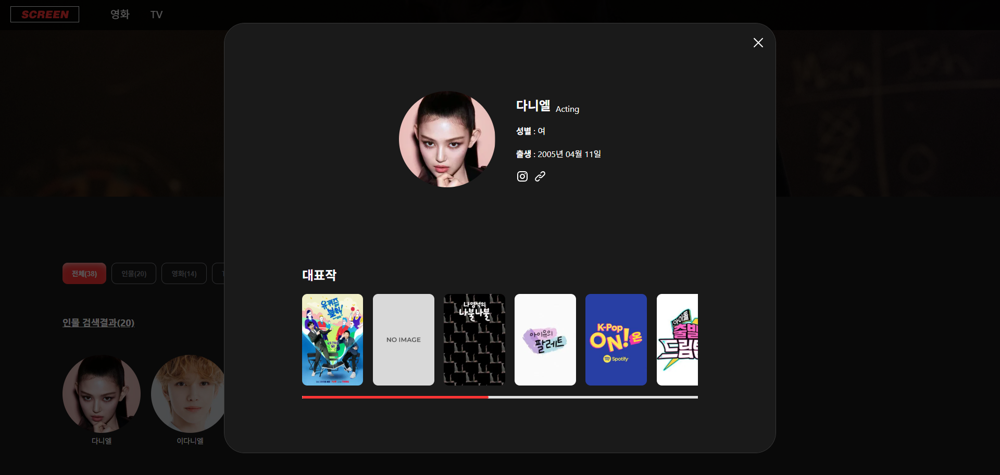
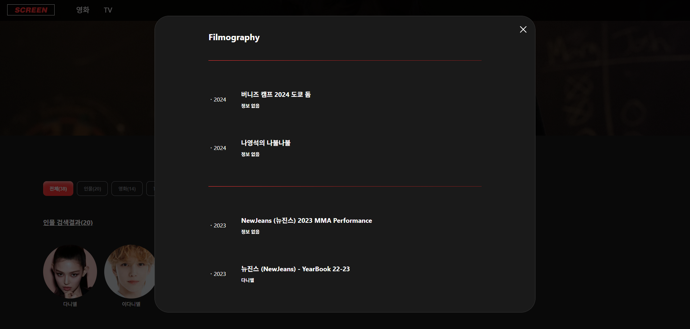
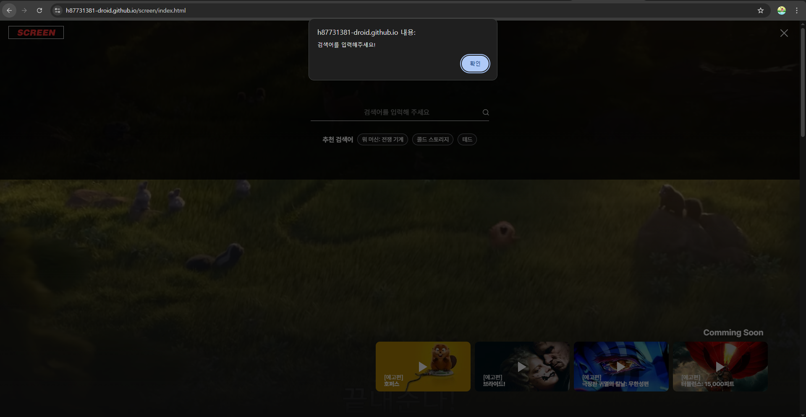

<h2>🎬 Screen – Movie & TV Explorer</h2>

👋 Hello, I'm Hyun Ju 

안녕하세요, 이현주 입니다.

📍 Korea

<h2>✨ 소개</h2>

이 프로젝트는 TMDB API를 기반으로 영화와 TV 콘텐츠 정보를 탐색할 수 있는 웹 서비스입니다.

사용자는 최신 인기 작품, 추천 콘텐츠, 배우 필모그래피 등을 확인하고 다양한 OTT 플랫폼에서 제공되는 작품 정보를 쉽게 찾아볼 수 있습니다.

직관적인 UI와 인터랙션을 통해 콘텐츠를 탐색하는 재미를 제공하며, 검색 기능과 필터링을 통해 원하는 영화와 TV 프로그램을 빠르게 발견할 수 있습니다. 또한 가로 슬라이드, 팝업 상세 정보 등 다양한 UI 요소를 활용하여 사용자 경험을 향상시키는 것을 목표로 합니다.

        
<h2>🔗 배포 URL</h2>

  <a href="https://dl-xogus.github.io/screen/">https://dl-xogus.github.io/screen/</a>

<h2>📑 프로젝트 요약</h2>
<h3>1. 주제</h3>
<ul>
  <li>TMDB API를 활용하여 영화와 TV 콘텐츠 정보를 탐색할 수 있는 웹 서비스 개발</li>
  <li>인기 작품, 추천 콘텐츠, 배우 정보 및 필모그래피 등을 한 곳에서 확인할 수 있는 콘텐츠 탐색 플랫폼 구현</li>
</ul>

<h3>2. 목표</h3>
<ul>
  <li>영화 및 TV 콘텐츠 정보를 직관적으로 탐색할 수 있는 UI/UX 구현</li>
  <li>외부 API를 활용한 데이터 기반 웹 서비스 개발 경험</li>
  <li>다양한 콘텐츠를 빠르게 탐색할 수 있도록 검색, 추천, 필터 기능 제공</li>
  <li>협업을 통해 Git 기반 프로젝트 관리 및 개발 프로세스 경험</li>
</ul>

<h3>3. 핵심 기능</h3>
<ul>
  <li>🔎 콘텐츠 검색 기능 (영화 / TV 프로그램)</li>
  <li>🎬 상세 정보 제공 (줄거리, 평점, 장르, 개봉일, 출연 배우)</li>
  <li>👤 배우 정보 및 필모그래피 조회</li>
  <li>📺 OTT 제공 플랫폼 정보 확인 (Netflix, Apple TV, Disney+, TVING, wavve)</li>
  <li>⭐ 추천 및 인기 콘텐츠 리스트 제공</li>
  <li>🖱 가로 슬라이드 및 드래그 인터랙션 UI</li>
</ul>

<h2>📆 기간 및 인원</h2>
<ul>
  <li>2026.01.31-2026.03.09 휴일 제외 총 22일</li>
  <ul>
    <li>기초 데이터 수집 및 화면 설계 시간 : 8일</li>
    <li>개발 및 테스트 기간 : 14일</li>
  </ul>
  <li>팀원 : 3명</li>
</ul>

<h2>👩🏻‍🤝‍🧑🏻 팀원 소개</h2>
<table>
  <thead>
    <tr>
      <th>이름</th>
      <th>주요 페이지</th>
      <th>해당</th>
    </tr>
  </thead>
  <tbody>
    <tr>
      <td>이태현</td>
      <td>메인 페이지, 리스트 페이지, 인물 상세 팝업</td>
      <td></td>
    </tr>
    <tr>
      <td>이현주</td>
      <td>검색 페이지, 추천 컨텐츠 팝업</td>
      <td>✔</td>
    </tr>
    <tr>
      <td>조성경</td>
      <td>영화 상세 팝업, TV 상세 팝업</td>
      <td></td>
    </tr>
  </tbody>
</table>

<h2>💡 주요 기능</h2>
<h3>1. 콘텐츠 탐색</h3>
<ul>
  <li>영화 및 TV 프로그램 검색</li>
  <li>검색 결과 페이지 제공</li>
  <li>검색어 기반 콘텐츠 필터링</li>
</ul>

<h3>2. 콘텐츠 정보 확인</h3>
<ul>
  <li>영화 / TV 상세 정보 제공</li>
  <li>줄거리, 평점, 장르, 개봉일 확인</li>
  <li>출연 배우 정보 제공</li>
  <li>관련 콘텐츠 / 에피소드 정보 확인</li>
</ul>

<h3>3. 배우 정보</h3>
<ul>
  <li>배우 상세 페이지</li>
  <li>배우 필모그래피 확인</li>
  <li>영화 / TV 출연 작품 목록 제공</li>
</ul>

<h3>4. 콘텐츠 추천</h3>
<ul>
  <li>인기 콘텐츠 목록 제공</li>
  <li>추천 콘텐츠 제공</li>
  <li>최신순 콘텐츠 정렬</li>
</ul>

<h3>5. OTT 제공 정보</h3>
<ul>
  <li>Netflix</li>
  <li>Apple TV</li>
  <li>Disney+</li>
  <li>TVING</li>
  <li>wavve</li>
</ul>

각 컨텐츠가 어떤 OTT에서 시청 가능한지 확인 가능

<h3>6. 인터랙션 UI</h3>
<ul>
  <li>가로 슬라이드 콘텐츠 리스트</li>
  <li>드래그 스크롤</li>
  <li>상세 정보 팝업</li>
  <li>검색 UI 인터랙션</li>
</ul>

<h2>🗂️ 폴더 구조</h2>
<pre>
  <code>
    📦 project
     ┣ 📂 css
     ┃ ┣ 📂 page
     ┃ ┃ ┣ popup-com.css
     ┃ ┃ ┣ popup-filmography.css
     ┃ ┃ ┣ popup-movieDetails.css
     ┃ ┃ ┣ popup-recommendList.css
     ┃ ┃ ┣ popup-tvDetails.css
     ┃ ┃ ┣ sub-list.css
     ┃ ┃ ┗ sub-search.css
     ┃ ┣ index.css
     ┃ ┣ common.css
     ┃ ┗ reset.css
     ┣ 📂 js
     ┃ ┣ sub-search.js
     ┃ ┣ sub-list.js
     ┃ ┣ popup-recommendList.js
     ┃ ┣ index.js
     ┃ ┗ common.js
     ┣ 📂 pages
     ┃ ┣ popup-filmography.html
     ┃ ┣ popup-movieDetails.html
     ┃ ┣ popup-tvDetails.html
     ┃ ┣ popup-recommendList.html
     ┃ ┣ sub-list.html
     ┃ ┗ sub-search.html
     ┣ 📂 images
     ┣ index.html
     ┗ README.md
  </code>
</pre>

<h2>💻 개발 환경</h2>
<h3>개발 도구</h3>
<table>
  <thead>
    <tr>
      <th>사용기술</th>
      <th>설명</th>
      <th>Badge</th>
    </tr>
  </thead>
  <tbody>
    <tr>
      <td>Visual Studio Code (VS Code)</td>
      <td>코드 편집기(에디터)</td>
      <td></td>
    </tr>
    <tr>
      <td>GitHub</td>
      <td>버전 관리</td>
      <td></td>
    </tr>
    <tr>
      <td>Figma</td>
      <td>디자인 & UI/UX</td>
      <td></td>
    </tr>
  </tbody>
</table>

<h1>이현주의 개발 상세</h1>
<h2>📑 요약</h2>
<ul>
  <li>담당 업무</li>
  <ul>
    <li>검색 페이지</li>
    <li>추천 컨텐츠 리스트 팝업</li>
    <li></li>
    <li></li>
    <li></li>
    <li></li>
  </ul>
  <li>담당 페이지 상세</li>
  <ul>
    <li>모든 데이터는 TMDB API 호출</li>
    <li>검색한 단어가 포함된 모든 컨텐츠 출력</li>
    <li>검색 키워드가 인물일시 관련 작품 출력</li>
    <li></li>
  </ul>
</ul>

<h2>🧩 공통 js, css 제작</h2>
<ul>
  <li>📜common.js - </li>
  <li>📜common.css - </li>
</ul>

<h2>💥 트러블 슈팅</h2>
<h3>📌 검색 페이지</h3>

1. 검색 키워드 미입력시에도 검색페이지로 넘어감 -> 안내 문구가 있는 alret 실행

2. 인물 검색시 관련 작품이 함께 출력되지 않아 부자연스러움 -> 관련 작품이 함께 출력되도록 추가

3. 데이터에서 제공되지 않는 이미지가 엑박으로 표시 -> '? ture : fales' 조건문을 만들어 포스터or인물사진이 데이터에 없을시 출력되는 이미지를 따로 제작하여 사용

<h3>📌 추천 컨텐츠 리스트 팝업</h3>

1. 닫기버튼(X)이 반응형일 때 위치 이동 -> a태그와 전체 컨텐츠를 묶는 부모인 div를 추가

2. 포스터에 호버시 이미지 크기가 확대되는 애니메이션을 넣었는데 디자인이 바뀜 (의도처럼 되지 않음) -> 이미지태그에 p태그를 추가하여 액자처럼 사용 (영역을 초과하면 숨기기)

3. 팝업창을 띄우고 스크롤시 배경이 같이 움직이는 문제 -> body에 overfilow-hidden을 추가하여 스크롤 감춤

4. 팝업창의 제목을 클릭한 컨텐츠에 맞게 바꾸기 -> 메인페이지에서 남아있는 localstorysi의 장르데이터 호출

<h2>📈 배운 점</h2>
<ul>
  <li>협업의 중요성</li>
  <li>커뮤니케이션 능력</li>
  <li>문제 해결 경험</li>
  <li>코드 작성 경험</li>
  <li>표현 구상 하기</li>
</ul>

<h2>👨‍💻 개발자</h2>

E-mail : h87731381@gmail.com

